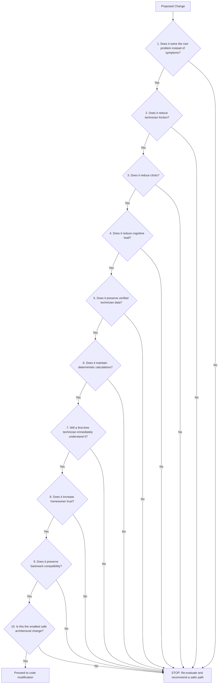

<!-- BEGIN:nextjs-agent-rules -->
# This is NOT the Next.js you know

This version has breaking changes — APIs, conventions, and file structure may all differ from your training data. Read the relevant guide in `node_modules/next/dist/docs/` before writing any code. Heed deprecation notices.
<!-- END:nextjs-agent-rules -->

# Panda HVAC Platform - Agent Rules & Repository Constitution

Welcome to the Panda HVAC Engineering Platform codebase. This document serves as the permanent engineering guide and repository constitution for all future AI coding agents modifying this project. It outlines the core system mission, trust philosophy, UX framework, system architecture directory, architectural rules, and the decision framework that governs every code contribution.

---

## 1. MISSION & PRODUCT VISION

This software does not exist to be a simple, standalone HVAC calculator. It is a commercial-grade HVAC Engineering, Technician Workflow, and Sales Platform. It has been built specifically to:
1. **Reduce Technician Workload**: Eliminate redundant data entry and paperwork, saving design time in the field.
2. **Increase Engineering Accuracy**: Enforce strict ACCA standards to eliminate manual calculation errors.
3. **Build Homeowner Trust**: Establish clear, defensible, and visual recommendations that educate the customer rather than confuse them.
4. **Help HVAC Companies Confidently Close Contracts**: Turn complex thermodynamic analysis into a persuasive, transparent sales experience.
5. **Produce Engineering-Backed Recommendations**: Generate transparent design results with a traceable data audit trail.

Every future feature, refactor, or hotfix proposed in this repository must directly support one or more of these design goals.

---

## 2. TRUST PHILOSOPHY

This platform is architected around the value of **trust**. In residential contracting, the engineering process itself is a critical part of the customer sales experience. 

* **The Engineered Promise**: The homeowner should finish the sales workflow believing: *"This system recommendation was engineered specifically for my home, not guessed by a salesperson."*
* **Evidence-Based Recommendations**: Every engineering step must compile into a clear explanation.
  * Verified field measurements become **evidence**.
  * The physical blueprint outline becomes **proof**.
* **Respect the Science**: The application must never simplify HVAC engineering by cutting mathematical corners or using crude estimation rules-of-thumb. Instead, it must simplify the *process* of performing rigorous, standard-compliant HVAC engineering.

---

## 3. UX PHILOSOPHY

A set of core user experience principles guides the interaction model of the platform:

* **Think About the House, Not the Software**: The technician's mind should remain focused on the layout, materials, and envelope of the physical building. The UI should not force them to navigate nested software configurations.
* **The Blueprint is the Workspace**: The primary visual workspace is the drawing canvas overlay. Whenever possible, actions should be performed directly on the blueprint itself (spatial overlays, contextual canvas clicks) rather than in heavy side panels.
* **Guide, Don't Hide**: The system must explicitly guide the technician toward completion (e.g., showing the next logical step) instead of forcing them to search for hidden controls or options.
* **Contextual Actions over Navigation**: Keep interactions local to the element being edited. Clicking a wall should allow changing its classification immediately.
* **One Obvious Next Step**: Avoid analysis paralysis by presenting a single, highly visible recommended action at each workflow stage.
* **Terminology Alignment**: All engineering and building science terminology must remain professional (e.g., U-factor, SHGC, available static pressure, CFM). However, software-centric jargon (e.g., payloads, database keys, serialization, components) must never leak into the user experience.

---

## 4. ARCHITECTURE & SYSTEM DIRECTORY

Below is a detailed map of the current architecture, highlighting files, types, and logic blocks:

### A. Blueprint Workflow
Technicians upload floor plans to establish the foundation of the project.
* Core State Model: [BlueprintProject](file:///Users/tomashernandez/hvac-app/lib/hvac/blueprintProject.ts#L80) in [blueprintProject.ts](file:///Users/tomashernandez/hvac-app/lib/hvac/blueprintProject.ts) manages sheets, overlays, pages, calibration parameters, and coordinate mappings.
* Drawing Component: Handles canvas-based rendering and user vector drawing inputs in [LoadCalculator.tsx](file:///Users/tomashernandez/hvac-app/app/components/LoadCalculator.tsx).

### B. Calibration Engine
Establishes the pixel-to-foot scale ratio using screen overlay percentages.
* Code File: [blueprintCalibration.ts](file:///Users/tomashernandez/hvac-app/lib/hvac/blueprintCalibration.ts)
* Coordinate Parsing: [parseFeetInchesToFeet](file:///Users/tomashernandez/hvac-app/lib/hvac/blueprintCalibration.ts#L59) parses input strings containing decimal feet, mixed notations, or dash-shorthands (e.g. `12.5`, `12' 6"`, `12-6`).
* Verification & Confidence: Calculates measurement error percentage via [calculateBlueprintVerificationError](file:///Users/tomashernandez/hvac-app/lib/hvac/blueprintCalibration.ts#L138) and maps it to a confidence tier via [getBlueprintVerificationConfidence](file:///Users/tomashernandez/hvac-app/lib/hvac/blueprintCalibration.ts#L151) (verified: error <= 1.0%, acceptable: <= 3.0%, warning: > 3.0%).
* Confirmation & Locking: Once confirmed, `isLocked` is set to true to prevent accidental shifts.

### C. Room Tracing
Defines physical space boundaries using drawing canvas inputs.
* Code File: [blueprintRoomTracing.ts](file:///Users/tomashernandez/hvac-app/lib/hvac/blueprintRoomTracing.ts)
* Room Representation: Outlines are stored in [BlueprintRoomOutline](file:///Users/tomashernandez/hvac-app/lib/hvac/blueprintRoomTracing.ts#L43) tracking vertex coordinate arrays.
* Trace Assistance: The function [addBlueprintRoomTracePoint](file:///Users/tomashernandez/hvac-app/lib/hvac/blueprintRoomTracing.ts#L153) provides straight-line assist (orthogonal alignment constraints) and handles auto-closing of the trace loop when the cursor comes within 1% of the origin.

### D. Boundary Classification
Defines thermodynamic wall properties.
* Code File: [blueprintExteriorLoad.ts](file:///Users/tomashernandez/hvac-app/lib/hvac/blueprintExteriorLoad.ts)
* Edge Classification: Links traced boundaries in [BlueprintRoomBoundaryEdge](file:///Users/tomashernandez/hvac-app/lib/hvac/blueprintRoomTracing.ts#L36) to thermodynamic classifications: `exterior`, `interior`, `garage`, `adjacent`, `attic`, `crawlspace`, `unknown`.
* Dynamic Orientation: Compass orientation angles are computed by [calculateBlueprintExteriorEdgeOrientation](file:///Users/tomashernandez/hvac-app/lib/hvac/blueprintExteriorLoad.ts#L350), which vectors the compass direction from the room centroid to the boundary midpoint.

### E. Opening Verification
Audits the details of windows and doors on exterior walls.
* Opening State: Windows and doors are stored as [BlueprintWallOpening](file:///Users/tomashernandez/hvac-app/lib/hvac/blueprintRoomTracing.ts#L14) within boundary edge properties.
* Strict Audit: Features an `isVerified` boolean. AI suggested openings are marked unverified and must be audited and verified individually by the technician.

### F. Room Readiness Engine
Checks the completeness of traced rooms before permitting calculation handoffs.
* Code File: [roomReadiness.ts](file:///Users/tomashernandez/hvac-app/lib/hvac/roomReadiness.ts)
* Function: [calculateRoomReadiness](file:///Users/tomashernandez/hvac-app/lib/hvac/roomReadiness.ts#L22) validates rooms across four pillars: Geometry (min points and valid area), Calibration (confirmed status), Walls (all boundaries classified), and Openings (all exterior openings verified). It outputs statuses: `READY_FOR_MANUAL_J`, `NEEDS_REVIEW`, `INCOMPLETE`.

### G. Manual J Handoff & Pipeline
Converts verified takeoff data into ACCA Manual J load calculations.
* Code File: [manualJService.ts](file:///Users/tomashernandez/hvac-app/lib/hvac/domain/manualJService.ts) and [roomCalculationPipeline.ts](file:///Users/tomashernandez/hvac-app/lib/hvac/roomCalculationPipeline.ts)
* Core Calculations: [calculateConductiveLoad](file:///Users/tomashernandez/hvac-app/lib/hvac/domain/manualJService.ts#L14) calculates conductive heat transfers ($Q = U \times A \times \Delta T$).
* Region Delta-T: [getBlueprintOregonDesignDeltaT](file:///Users/tomashernandez/hvac-app/lib/hvac/blueprintExteriorLoad.ts#L500) queries Oregon target design outdoor and indoor temperatures.
* Unified Model: [UnifiedHvacRoom](file:///Users/tomashernandez/hvac-app/lib/hvac/roomCalculationPipeline.ts#L14) and [createUnifiedTracedRoom](file:///Users/tomashernandez/hvac-app/lib/hvac/roomCalculationPipeline.ts#L109) adapt and calculate outputs from traced rooms, manual rooms, and AI-detected rooms ([DetectedBlueprintRoom](file:///Users/tomashernandez/hvac-app/lib/hvac/blueprintDetection.ts#L7)) detected via [detectRoomsFromBlueprint](file:///Users/tomashernandez/hvac-app/lib/hvac/blueprintDetection.ts#L131).

### H. Manual D Workflow
Sizes ductwork and registers to deliver target room airflow CFM.
* Code File: [manualD.ts](file:///Users/tomashernandez/hvac-app/lib/hvac/manualD.ts) and [manualDService.ts](file:///Users/tomashernandez/hvac-app/lib/hvac/domain/manualDService.ts)
* Formulas: Calculates airflow needs using [calculateRoomAirflowTarget](file:///Users/tomashernandez/hvac-app/lib/hvac/domain/manualDService.ts#L14) ($CFM = BTU / (1.08 \times \Delta T)$), Available Static Pressure (ASP) using [calculateAvailableStaticPressure](file:///Users/tomashernandez/hvac-app/lib/hvac/manualD.ts#L56), and Total Equivalent Length (TEL) using [calculateTotalEquivalentLength](file:///Users/tomashernandez/hvac-app/lib/hvac/manualD.ts#L64).
* Duct Sizing: Recommends standard round metal duct diameters via [recommendRoundDuctSize](file:///Users/tomashernandez/hvac-app/lib/hvac/manualD.ts#L177), ensuring FPM velocity limits do not exceed 900 FPM (main trunks) or 700 FPM (branch runs).
* UI Panel: Interlocked component is [ManualDPanel.tsx](file:///Users/tomashernandez/hvac-app/app/components/ManualDPanel.tsx).

### I. Proposal System
Generates proposal estimates and options.
* Code File: [CustomerProposal.tsx](file:///Users/tomashernandez/hvac-app/app/components/CustomerProposal.tsx)
* Core Behavior: Pulls in total loads and recommended HVAC equipment configurations to present custom sizing options to homeowners.

### J. Engineering Audit Philosophy
A set of state-flow validations that enforce alignment, tracing, and data synchronization.
* Dependency Reducer: [projectEngine.ts](file:///Users/tomashernandez/hvac-app/lib/hvac/engine/projectEngine.ts) manages state transitions.
* Dirty Flag Cascades: Upstream updates trigger [ProjectDirtyFlag](file:///Users/tomashernandez/hvac-app/lib/hvac/engine/projectEngineTypes.ts#L15) values, which automatically clear verified milestones downstream (e.g. resetting Manual J and Manual D statuses via [resetDependentMilestones](file:///Users/tomashernandez/hvac-app/lib/hvac/engine/projectEngine.ts#L199) if calibration or boundary outlines change).
* Project Health: [projectHealth.ts](file:///Users/tomashernandez/hvac-app/lib/hvac/engine/projectHealth.ts) checks state inputs via [getProjectHealthItems](file:///Users/tomashernandez/hvac-app/lib/hvac/engine/projectHealth.ts#L13) and compiles a project health score via [calculateProjectHealthScore](file:///Users/tomashernandez/hvac-app/lib/hvac/engine/projectHealth.ts#L124).
* warning Alerts: Real-time calculation out-of-sync indicators are populated by [getProjectWarnings](file:///Users/tomashernandez/hvac-app/lib/hvac/engine/projectWarnings.ts#L26) in [projectWarnings.ts](file:///Users/tomashernandez/hvac-app/lib/hvac/engine/projectWarnings.ts).
* Workflow Guarding: [getStageGuard](file:///Users/tomashernandez/hvac-app/lib/hvac/engine/projectWorkflowController.ts#L8) in [projectWorkflowController.ts](file:///Users/tomashernandez/hvac-app/lib/hvac/engine/projectWorkflowController.ts) guards transitions between stages (e.g., SETUP → CALIBRATION → TAKEOFF → ENVELOPE → LOAD_CALC → DUCT_DESIGN → PROPOSAL → REPORT → EXPORT).

---

## 5. LONG-TERM ARCHITECTURAL RULES & SAFETY

AI coding agents must adhere to the following safety rules to preserve software and calculations integrity:

1. **Audit Before Modifying**: Never write code in a module without tracing its inputs and outputs back to the core domain files. Use [hvacConstants.ts](file:///Users/tomashernandez/hvac-app/lib/hvac/domain/hvacConstants.ts) as the absolute authority on engineering constants.
2. **Trace Data Before Refactoring**: Understand the cascade of [ProjectDirtyFlag](file:///Users/tomashernandez/hvac-app/lib/hvac/engine/projectEngineTypes.ts#L15) resets. Do not bypass or break the dependency mapping governed by [resetDependentMilestones](file:///Users/tomashernandez/hvac-app/lib/hvac/engine/projectEngine.ts#L199).
3. **Never Replace Verified Measurements**: Once a technician marks a measurement, wall boundary type, or window dimension as verified (`isVerified: true`), AI code must never automatically overwrite or suggest changes to it.
4. **Never Silently Change Formulas**: Any modification to heat transfer ($Q = U \times A \times \Delta T$) or friction rate formulas must be explicitly brought to the user's attention. Silence is an engineering regression.
5. **Preserve Determinism**: Avoid heuristic or probabilistic calculations for mechanical calculations. The backend engineering equations must always run deterministically.
6. **Prefer Additive Architecture**: When adding new functionality (e.g., support for rectangular ducts or custom fittings), build on top of current models and components rather than refactoring or replacing working code.
7. **Surgical Patches over Rewrites**: Write minimal, precise diffs. Do not rewrite files or modules if a targeted change satisfies the ticket.
8. **One Patch → One Validation → One Commit**: Ensure each change is isolated, thoroughly tested for mathematical and workflow regressions, and committed individually to preserve git history transparency.

---

## 6. AI DECISION FRAMEWORK

Before presenting a solution or writing any code in this repository, every AI agent should perform a self-audit against the following ten checks:

**If the answer to any question is "No," the agent MUST STOP immediately, flag the potential issue, and recommend a safer alternative to the user.**

---

## 7. THE REPOSITORY CONSTITUTION

Every future AI coding agent working in this workspace is bound by this constitution:

* **WE BELIEVE** that residential HVAC design is an exact science, and our codebase must reflect that precision.
* **WE PROTECT** the technician's hard work in the field. What is verified stays verified.
* **WE CHOOSE** simplicity of workflow over complexity of design, but we never compromise on engineering standards.
* **WE RESPECT** the dependency engine. Stale calculations are safety warnings; they must be surfaced, never hidden or skipped.
* **WE WRITE** code that is surgical, additive, stable, and backwards-compatible. We value the reliability of the platform above developer convenience.
